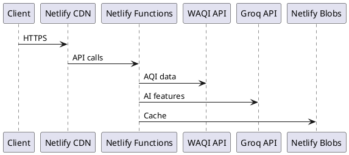

# ডেভেলপমেন্ট টুলিং

এই পৃষ্ঠায় JanVayu তৈরি এবং রক্ষণাবেক্ষণের জন্য ব্যবহৃত টুল এবং ওয়ার্কফ্লো নিয়ে আলোচনা করা হয়েছে — যেখানে মূলত AI-সহায়ক ডেভেলপমেন্ট টুল Claude Code-এর ওপর জোর দেওয়া হয়েছে।

---

## Claude Code (Anthropic)

সফটওয়্যার ইঞ্জিনিয়ারিংয়ের জন্য Anthropic-এর CLI এজেন্ট **Claude Code**-এর উল্লেখযোগ্য সহায়তায় JanVayu তৈরি করা হয়েছে। Claude Code নিচের কাজগুলোতে ব্যবহার করা হয়েছে:

- Netlify Functions লেখা
- ফ্রন্টএন্ড তৈরি করা (`index.html`, `app.js`, `styles.css` এবং প্যানেল ফ্র্যাগমেন্ট)
- gpt-oss-120b প্রম্পট ইঞ্জিনিয়ারিং (স্কিল ফাইল) তৈরি করা
- এই Docsify ডকুমেন্টেশন তৈরি করা
- Git ওয়ার্কফ্লো (commits, PRs, changelogs) পরিচালনা করা
- সার্ভারলেস ফাংশনের সমস্যা ডিবাগ করা
- কোড রিভিউ এবং রিফ্যাক্টরিং

JanVayu তৈরির জন্য ব্যবহৃত সম্পূর্ণ Claude Code সেটআপ, ওয়ার্কফ্লো এবং কনফিগারেশন সম্পর্কে জানতে [Claude Code সেকশন](../claude-code/overview.md) দেখুন।

---

## এডিটর কনফিগারেশন

`.editorconfig` সব কন্ট্রিবিউটরদের মধ্যে ফরম্যাটিং স্ট্যান্ডার্ডাইজ করে:

| ফাইলের ধরন | ইনডেন্টেশন |
|-----------|-------------|
| HTML, CSS, JS, JSON, YAML | ২ স্পেস |
| Python | ৪ স্পেস |
| Makefile | ট্যাব |

সব ফাইল: UTF-8, LF লাইন এন্ডিং, ট্রেইলিং হোয়াইটস্পেস ট্রিম করা (Markdown বাদে)।

---

## Git ওয়ার্কফ্লো

### কমিট মেসেজ কনভেনশন

`commit-msg` হুক দ্বারা এটি প্রয়োগ করা হয়। প্রতিটি কমিট নিচের যেকোনো একটি দিয়ে শুরু হতে হবে:

```
Add:       — নতুন ফিচার বা ফাইল
Fix:       — বাগ ফিক্স
Update:    — বিদ্যমান ফিচারের উন্নতি
Translate: — নতুন বা আপডেট করা অনুবাদ
Docs:      — ডকুমেন্টেশনের পরিবর্তন
Refactor:  — কোড রি-স্ট্রাকচারিং (আচরণে কোনো পরিবর্তন নেই)
Test:      — টেস্ট যোগ বা পরিবর্তন
CI:        — CI/CD পাইপলাইনের পরিবর্তন
Chore:     — রক্ষণাবেক্ষণের কাজ
Merge:     — মার্জ কমিট
```

### প্রি-কমিট চেক

`pre-commit` হুক স্বয়ংক্রিয়ভাবে:
১. `.env`, ক্রেডেনশিয়াল এবং সিক্রেট ফাইল স্টেজিং ব্লক করে
২. `console.log` ডিবাগ স্টেটমেন্ট সম্পর্কে সতর্ক করে
৩. মার্জ কনফ্লিক্ট মার্কার (`<<<<<<<`) শনাক্ত করে
৪. ৫০০ KB-এর চেয়ে বড় ফাইলের ক্ষেত্রে সতর্ক করে

### ব্রাঞ্চ স্ট্র্যাটেজি

- `main` — প্রোডাকশন (Netlify-তে স্বয়ংক্রিয়ভাবে ডিপ্লয় হয়)
- `claude/*` — Claude Code ডেভেলপমেন্ট ব্রাঞ্চ (main-এ PR)
- ফিচার ব্রাঞ্চগুলো Pull Request-এর মাধ্যমে মার্জ হয়

---

## লোকাল ডেভেলপমেন্ট

```bash
# Install dependencies (server-side only)
npm install

# Run locally with Netlify Functions emulation
netlify dev
```

`netlify dev` লোকালি সম্পূর্ণ Netlify এনভায়রনমেন্ট ইমুলেট করে:
- `localhost:8888`-এ `index.html` সার্ভ করে
- সব Netlify Functions ইমুলেট করে
- এনভায়রনমেন্ট ভেরিয়েবলের জন্য `.env` পড়ে
- Netlify Blobs সিমুলেট করে
অন্য কোনো সেটআপের প্রয়োজন নেই। কোনো Docker নেই, কোনো database নেই, কোনো bundler নেই (ডিপ্লয় করার সময় একটি ভার্সন-স্ট্যাম্প স্ক্রিপ্ট রান করে)।

---

## Docs Stack

ডকুমেন্টেশন সাইটটি হলো `/docs/`-এ থাকা একটি সিঙ্গেল-পেজ Docsify শেল, যা সরাসরি `docs/` ডিরেক্টরি থেকে markdown লোড করে। অনুবাদ করা ভাষাগুলো `docs-{lang}/`-এ থাকে এবং Docsify হ্যাশ রুট (যেমন `/docs/#/hi/`)-এর মাধ্যমে রাউট করা হয়।

| কম্পোনেন্ট | এটি কী করে |
|-----------|-------------|
| **Docsify** | ব্রাউজারে markdown-কে HTML-এ রেন্ডার করে; কোনো বিল্ড স্টেপের প্রয়োজন নেই |
| **docsify-themeable** | ডার্ক মোডসহ ব্র্যান্ড-রঙের থিম (JanVayu সবুজ) |
| **docsify-pagination** | পেজগুলোর মধ্যে Previous/Next নেভিগেশন |
| **docsify-copy-code** | প্রতিটি কোড ব্লকে কপি বাটন |
| **Prism.js** | bash, JS, JSON, YAML, TOML, Markdown-এর জন্য সিনট্যাক্স হাইলাইটিং |
| **docsify-search, docsify-zoom-image** | পেজের ভেতরে সার্চ এবং ইমেজ জুম |

### ডায়াগ্রামের জন্য PlantUML ব্যবহার করা

Docsify নিজে থেকে সার্ভার-সাইডে PlantUML রেন্ডার করে না। আপনার যদি কোনো ডক পেজে ডায়াগ্রামের প্রয়োজন হয়, তবে PlantUML CLI (বা কোনো হোস্ট করা PlantUML সার্ভার) দিয়ে লোকালি PNG/SVG জেনারেট করুন এবং ইমেজটি `docs/`-এ কমিট করুন। এরপর এটিকে সাধারণ markdown ইমেজ হিসেবে এমবেড করুন। PlantUML সোর্সের উদাহরণ:

````

````

---

## CI Workflows

| ওয়ার্কফ্লো | ট্রিগার | উদ্দেশ্য |
|----------|---------|---------|
| **Link Checker** (`.github/workflows/ci.yml`) | `main`-এ Push/PR | Lychee দিয়ে সব markdown এবং HTML লিংক ভ্যালিডেট করে |
| **Translation Sync** (`.github/workflows/translations.yml`) | `main`-এ Push (docs পাথ) | ট্রান্সলেশন কভারেজ, SUMMARY.md প্যারিটি এবং পুরোনো ট্রান্সলেশনগুলো চেক করে |

---

## ডিপেন্ডেন্সি ম্যানেজমেন্ট

- **Dependabot** প্রতি মাসে npm এবং GitHub Actions-এর আপডেট চেক করে
- মেইনটেইন করার মতো মাত্র ৩টি npm প্যাকেজ আছে
- CDN-লোড করা লাইব্রেরিগুলো (Chart.js 4.4.7, Leaflet 1.9.4) SRI হ্যাশসহ নির্দিষ্ট ভার্সনে পিন করা আছে
