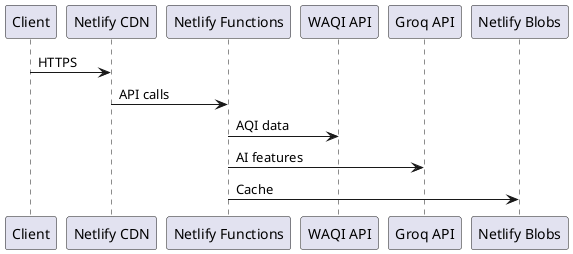

# डेवलपमेंट टूलिंग

इस पेज में JanVayu को बनाने और मेंटेन करने में इस्तेमाल होने वाले टूल्स और वर्कफ़्लो के बारे में बताया गया है — जिसमें मुख्य रूप से AI-असिस्टेड डेवलपमेंट टूल, Claude Code पर फोकस किया गया है।

---

## Claude Code (Anthropic)

JanVayu को **Claude Code** (सॉफ्टवेयर इंजीनियरिंग के लिए Anthropic का CLI एजेंट) की काफी मदद से डेवलप किया गया था। Claude Code का इस्तेमाल इन कामों के लिए किया गया:

- Netlify Functions लिखना
- फ़्रंटएंड बनाना (`index.html`, `app.js`, `styles.css` और पैनल फ़्रैग्मेंट्स)
- gpt-oss-120b प्रॉम्प्ट इंजीनियरिंग (स्किल फ़ाइल्स) तैयार करना
- यह Docsify डॉक्यूमेंटेशन बनाना
- Git वर्कफ़्लो मैनेज करना (commits, PRs, changelogs)
- सर्वरलेस फ़ंक्शन की समस्याओं को डीबग करना
- कोड रिव्यू और रिफ़ैक्टरिंग

JanVayu बनाने में इस्तेमाल किए गए पूरे Claude Code सेटअप, वर्कफ़्लो और कॉन्फ़िगरेशन के लिए, समर्पित [Claude Code सेक्शन](../claude-code/overview.md) देखें।

---

## एडिटर कॉन्फ़िगरेशन

`.editorconfig` सभी कॉन्ट्रिब्यूटर्स के लिए फ़ॉर्मेटिंग को स्टैंडर्डाइज़ करता है:

| फ़ाइल का प्रकार | इंडेंटेशन |
|-----------|-------------|
| HTML, CSS, JS, JSON, YAML | 2 स्पेसेस |
| Python | 4 स्पेसेस |
| Makefile | Tabs |

सभी फ़ाइलें: UTF-8, LF लाइन एंडिंग्स, ट्रेलिंग व्हाइटस्पेस ट्रिम करें (Markdown को छोड़कर)।

---

## Git वर्कफ़्लो

### कमिट मैसेज कन्वेंशन

यह `commit-msg` हुक द्वारा लागू किया जाता है। हर कमिट इनमें से किसी एक से शुरू होना चाहिए:

```
Add:       — नया फ़ीचर या फ़ाइल
Fix:       — बग फ़िक्स
Update:    — मौजूदा फ़ीचर में सुधार
Translate: — नया या अपडेटेड ट्रांसलेशन
Docs:      — डॉक्यूमेंटेशन में बदलाव
Refactor:  — कोड रिस्ट्रक्चरिंग (बिहेवियर में कोई बदलाव नहीं)
Test:      — टेस्ट में जोड़ या बदलाव
CI:        — CI/CD पाइपलाइन में बदलाव
Chore:     — मेंटेनेंस टास्क
Merge:     — मर्ज कमिट्स
```

### प्री-कमिट चेक्स

`pre-commit` हुक अपने आप:
1. `.env`, क्रेडेंशियल्स और सीक्रेट फ़ाइलों को स्टेज होने से रोकता है
2. `console.log` डीबग स्टेटमेंट्स के बारे में चेतावनी देता है
3. मर्ज कॉन्फ़्लिक्ट मार्कर्स (`<<<<<<<`) का पता लगाता है
4. 500 KB से बड़ी फ़ाइलों पर चेतावनी देता है

### ब्रांच स्ट्रेटेजी

- `main` — प्रोडक्शन (Netlify पर ऑटो-डिप्लॉय होता है)
- `claude/*` — Claude Code डेवलपमेंट ब्रांचेस (main में PR)
- फ़ीचर ब्रांचेस पुल रिक्वेस्ट (Pull Request) के ज़रिए मर्ज होती हैं

---

## लोकल डेवलपमेंट

```bash
# Install dependencies (server-side only)
npm install

# Run locally with Netlify Functions emulation
netlify dev
```

`netlify dev` लोकली पूरे Netlify एनवायरनमेंट को एम्यूलेट करता है:
- `localhost:8888` पर `index.html` सर्व करता है
- सभी Netlify Functions को एम्यूलेट करता है
- एनवायरनमेंट वेरिएबल्स के लिए `.env` को पढ़ता है
- Netlify Blobs को सिमुलेट करता है
किसी अन्य सेटअप की आवश्यकता नहीं है। कोई Docker नहीं, कोई database नहीं, कोई bundler नहीं (डिप्लॉय पर एक वर्ज़न-स्टैम्प स्क्रिप्ट चलती है)।

---

## डॉक्स स्टैक

डॉक्यूमेंटेशन साइट `/docs/` पर एक सिंगल-पेज Docsify शेल है जो सीधे `docs/` डायरेक्टरी से markdown लोड करती है। अनुवाद की गई भाषाएं `docs-{lang}/` में रहती हैं और Docsify हैश रूट (जैसे `/docs/#/hi/`) के ज़रिए रूट की जाती हैं।

| कंपोनेंट | यह क्या करता है |
|-----------|-------------|
| **Docsify** | ब्राउज़र में markdown को HTML में रेंडर करता है; कोई बिल्ड स्टेप नहीं |
| **docsify-themeable** | डार्क मोड के साथ ब्रांड-कलर थीम (JanVayu हरा) |
| **docsify-pagination** | पेजों के बीच Previous/Next नेविगेशन |
| **docsify-copy-code** | हर कोड ब्लॉक पर कॉपी बटन |
| **Prism.js** | bash, JS, JSON, YAML, TOML, Markdown के लिए सिंटैक्स हाइलाइटिंग |
| **docsify-search, docsify-zoom-image** | पेज के अंदर सर्च और इमेज ज़ूम |

### डायग्राम के लिए PlantUML का इस्तेमाल करना

Docsify खुद सर्वर-साइड पर PlantUML को रेंडर नहीं करता है। अगर आपको किसी डॉक पेज में डायग्राम की ज़रूरत है, तो PlantUML CLI (या किसी होस्टेड PlantUML सर्वर) के साथ लोकल रूप से PNG/SVG जनरेट करें और इमेज को `docs/` में कमिट करें। फिर इसे एक रेगुलर markdown इमेज के रूप में एम्बेड करें। उदाहरण PlantUML सोर्स:

````

````

---

## CI वर्कफ़्लो

| वर्कफ़्लो | ट्रिगर | उद्देश्य |
|----------|---------|---------|
| **Link Checker** (`.github/workflows/ci.yml`) | `main` पर पुश/PR | Lychee के साथ सभी markdown और HTML लिंक को वैलिडेट करता है |
| **Translation Sync** (`.github/workflows/translations.yml`) | `main` पर पुश (docs पाथ) | ट्रांसलेशन कवरेज, SUMMARY.md पैरिटी, और पुरानी ट्रांसलेशन चेक करता है |

---

## डिपेंडेंसी मैनेजमेंट

- **Dependabot** हर महीने npm और GitHub Actions अपडेट चेक करता है
- मेंटेन करने के लिए केवल 3 npm पैकेज हैं
- CDN-लोडेड लाइब्रेरी (Chart.js 4.4.7, Leaflet 1.9.4) को SRI हैश के साथ सटीक वर्ज़न पर पिन किया गया है
