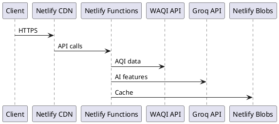

# डेव्हलपमेंट टूलिंग

या पानावर JanVayu बनवण्यासाठी आणि त्याची देखभाल करण्यासाठी वापरली जाणारी टूल्स आणि वर्कफ्लो दिली आहेत — ज्यामध्ये प्रामुख्याने AI-सपोर्टेड डेव्हलपमेंट टूल असलेल्या Claude Code वर लक्ष केंद्रित केले आहे.

---

## Claude Code (Anthropic)

सॉफ्टवेअर इंजिनिअरिंगसाठी Anthropic चा CLI एजंट असलेल्या **Claude Code** च्या मोठ्या मदतीने JanVayu विकसित केले गेले. Claude Code चा वापर खालील गोष्टींसाठी केला गेला:

- Netlify Functions लिहिण्यासाठी
- फ्रंटएंड बनवण्यासाठी (`index.html`, `app.js`, `styles.css` आणि पॅनेल फ्रॅगमेंट्स)
- gpt-oss-120b प्रॉम्प्ट इंजिनिअरिंग (स्किल फाइल्स) तयार करण्यासाठी
- हे Docsify डॉक्युमेंटेशन तयार करण्यासाठी
- Git वर्कफ्लो (commits, PRs, changelogs) मॅनेज करण्यासाठी
- सर्व्हरलेस फंक्शनच्या समस्या डीबग करण्यासाठी
- कोड रिव्ह्यू आणि रिफॅक्टरिंग करण्यासाठी

JanVayu बनवण्यासाठी वापरलेली संपूर्ण Claude Code सेटअप, वर्कफ्लो आणि कॉन्फिगरेशन पाहण्यासाठी, खास [Claude Code सेक्शन](../claude-code/overview.md) पहा.

---

## एडिटर कॉन्फिगरेशन

`.editorconfig` सर्व कॉन्ट्रिब्युटर्समधील फॉरमॅटिंग स्टँडर्डाईज करते:

| फाइल प्रकार | इंडेंटेशन |
|-----------|-------------|
| HTML, CSS, JS, JSON, YAML | 2 स्पेसेस |
| Python | 4 स्पेसेस |
| Makefile | टॅब्स |

सर्व फाइल्स: UTF-8, LF लाईन एंडिंग्स, ट्रेलिंग व्हाईटस्पेस ट्रिम करणे (Markdown सोडून).

---

## Git वर्कफ्लो

### कमिट मेसेज कन्व्हेन्शन

`commit-msg` हुकद्वारे हे सक्तीचे केले आहे. प्रत्येक कमिट खालीलपैकी एकाने सुरू झाले पाहिजे:

```
Add:       — नवीन फीचर किंवा फाइल
Fix:       — बग फिक्स
Update:    — सध्याच्या फीचरमध्ये सुधारणा
Translate: — नवीन किंवा अपडेट केलेले ट्रान्सलेशन
Docs:      — डॉक्युमेंटेशनमधील बदल
Refactor:  — कोड रिस्ट्रक्चरिंग (कोणताही बिहेविअर बदल नाही)
Test:      — टेस्ट ॲडिशन्स किंवा बदल
CI:        — CI/CD पाईपलाईनमधील बदल
Chore:     — मेंटेनन्सची कामे
Merge:     — मर्ज कमिट्स
```

### प्री-कमिट चेक्स

`pre-commit` हुक आपोआप:
1. `.env`, क्रेडेंशियल्स आणि सिक्रेट फाइल्स स्टेज होण्यापासून ब्लॉक करते
2. `console.log` डीबग स्टेटमेंट्सबद्दल वॉर्निंग देते
3. मर्ज कॉन्फ्लिक्ट मार्कर्स (`<<<<<<<`) शोधते
4. 500 KB पेक्षा मोठ्या फाइल्सवर वॉर्निंग देते

### ब्रांच स्ट्रॅटेजी

- `main` — प्रॉडक्शन (Netlify वर ऑटो-डिप्लॉय होते)
- `claude/*` — Claude Code डेव्हलपमेंट ब्रांचेस (main मध्ये PR)
- फीचर ब्रांचेस पुल रिक्वेस्टद्वारे मर्ज होतात

---

## लोकल डेव्हलपमेंट

```bash
# Install dependencies (server-side only)
npm install

# Run locally with Netlify Functions emulation
netlify dev
```

`netlify dev` लोकली संपूर्ण Netlify एन्व्हायर्नमेंटचे एमुलेशन करते:
- `localhost:8888` वर `index.html` सर्व्ह करते
- सर्व Netlify Functions चे एमुलेशन करते
- एन्व्हायर्नमेंट व्हेरिएबल्ससाठी `.env` वाचते
- Netlify Blobs सिमुलेट करते
इतर कोणत्याही सेटअपची गरज नाही. Docker नाही, database नाही, bundler नाही (deploy करताना फक्त एक version-stamp script चालते).

---

## Docs Stack

डॉक्युमेंटेशन साईट हे `/docs/` वरील एक सिंगल-पेज Docsify शेल आहे, जे `docs/` डिरेक्टरीमधून थेट markdown लोड करते. अनुवादित भाषा `docs-{lang}/` मध्ये असतात आणि त्या Docsify hash routes द्वारे (उदा. `/docs/#/hi/`) ॲक्सेस केल्या जातात.

| घटक | ते काय करते |
|-----------|-------------|
| **Docsify** | ब्राउझरमध्ये markdown ला HTML मध्ये रेंडर करते; कोणतीही build स्टेप नाही |
| **docsify-themeable** | ब्रँड-रंगीत थीम (JanVayu हिरवा) आणि डार्क मोड |
| **docsify-pagination** | पानांमध्ये Previous/Next नेव्हिगेशन |
| **docsify-copy-code** | प्रत्येक कोड ब्लॉकवर कॉपी बटण |
| **Prism.js** | bash, JS, JSON, YAML, TOML, Markdown साठी सिंटॅक्स हायलायटिंग |
| **docsify-search, docsify-zoom-image** | इन-पेज सर्च आणि इमेज झूम |

### आकृत्यांसाठी PlantUML वापरणे

Docsify स्वतः PlantUML ला सर्व्हर-साईडवर रेंडर करत नाही. जर तुम्हाला डॉक पेजमध्ये आकृती हवी असेल, तर PlantUML CLI (किंवा होस्ट केलेल्या PlantUML सर्व्हर) वापरून PNG/SVG लोकली तयार करा आणि ती इमेज `docs/` मध्ये कमिट करा. त्यानंतर ती एक सामान्य markdown इमेज म्हणून एम्बेड करा. उदाहरण PlantUML सोर्स:

````

````

---

## CI Workflows

| वर्कफ्लो | ट्रिगर | उद्देश |
|----------|---------|-------------|
| **Link Checker** (`.github/workflows/ci.yml`) | `main` वर पुश/PR | Lychee वापरून सर्व markdown आणि HTML लिंक्स प्रमाणित करते |
| **Translation Sync** (`.github/workflows/translations.yml`) | `main` वर पुश (docs पाथ्स) | ट्रान्सलेशन कव्हरेज, SUMMARY.md पॅरिटी आणि जुने ट्रान्सलेशन्स तपासते |

---

## डिपेंडन्सी मॅनेजमेंट

- **Dependabot** दर महिन्याला npm आणि GitHub Actions अपडेट्स तपासते
- मेंटेन करण्यासाठी फक्त 3 npm पॅकेजेस
- CDN-लोड केलेल्या लायब्ररीज (Chart.js 4.4.7, Leaflet 1.9.4) अचूक व्हर्जन्स आणि SRI हॅशेससह पिन केल्या आहेत
