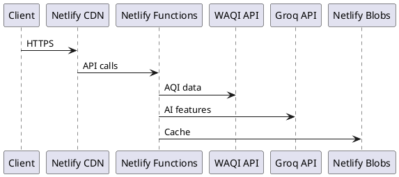

# மேம்பாட்டு கருவிகள்

இந்த பக்கம் JanVayu-ஐ உருவாக்கவும் பராமரிக்கவும் பயன்படுத்தப்படும் கருவிகள் மற்றும் பணிப்பாய்வுகளை (workflows) உள்ளடக்கியது — குறிப்பாக, முதன்மை AI-உதவி மேம்பாட்டு கருவியான Claude Code-ஐப் பற்றி கவனம் செலுத்துகிறது.

---

## Claude Code (Anthropic)

மென்பொருள் பொறியியலுக்கான Anthropic-இன் CLI ஏஜெண்டான **Claude Code**-இன் கணிசமான உதவியுடன் JanVayu உருவாக்கப்பட்டது. Claude Code பின்வரும் பணிகளுக்குப் பயன்படுத்தப்பட்டது:

- Netlify Functions-ஐ எழுதுதல்
- frontend-ஐ உருவாக்குதல் (`index.html`, `app.js`, `styles.css` மற்றும் panel துண்டுகள்)
- gpt-oss-120b prompt engineering (skill கோப்புகள்)-ஐ உருவாக்குதல்
- இந்த Docsify ஆவணத்தை உருவாக்குதல்
- Git பணிப்பாய்வை நிர்வகித்தல் (commits, PRs, changelogs)
- serverless function சிக்கல்களை debug செய்தல்
- Code review மற்றும் refactoring

JanVayu-ஐ உருவாக்கப் பயன்படுத்தப்பட்ட முழுமையான Claude Code அமைப்பு, பணிப்பாய்வு மற்றும் உள்ளமைவுக்கு, பிரத்யேகமான [Claude Code பகுதியை](../claude-code/overview.md) பார்க்கவும்.

---

## Editor Configuration

`.editorconfig` அனைத்து பங்களிப்பாளர்களுக்கும் இடையிலான வடிவமைப்பை (formatting) தரப்படுத்துகிறது:

| கோப்பு வகை | Indentation |
|-----------|-------------|
| HTML, CSS, JS, JSON, YAML | 2 spaces |
| Python | 4 spaces |
| Makefile | Tabs |

அனைத்து கோப்புகளும்: UTF-8, LF line endings, trim trailing whitespace (Markdown தவிர).

---

## Git Workflow

### Commit Message Convention

`commit-msg` hook மூலம் இது கட்டாயமாக்கப்பட்டுள்ளது. ஒவ்வொரு commit-உம் பின்வருவனவற்றில் ஒன்றிலிருந்து தொடங்க வேண்டும்:

```
Add:       — புதிய அம்சம் அல்லது கோப்பு
Fix:       — பிழை திருத்தம்
Update:    — தற்போதைய அம்சத்தில் மேம்பாடு
Translate: — புதிய அல்லது புதுப்பிக்கப்பட்ட மொழிபெயர்ப்பு
Docs:      — ஆவணமாக்கலில் மாற்றங்கள்
Refactor:  — நிரல் மறுசீரமைப்பு (செயல்பாட்டில் மாற்றம் இல்லை)
Test:      — சோதனை சேர்த்தல் அல்லது மாற்றங்கள்
CI:        — CI/CD pipeline மாற்றங்கள்
Chore:     — பராமரிப்பு பணிகள்
Merge:     — Merge commits
```

### Pre-Commit Checks

`pre-commit` hook தானாகவே:
1. `.env`, சான்றுகள் (credentials) மற்றும் ரகசிய கோப்புகளை staging செய்வதைத் தடுக்கிறது
2. `console.log` debug அறிக்கைகள் குறித்து எச்சரிக்கிறது
3. merge conflict குறிகாட்டிகளை (`<<<<<<<`) கண்டறிகிறது
4. 500 KB-க்கும் பெரிய கோப்புகள் குறித்து எச்சரிக்கிறது

### Branch Strategy

- `main` — production (Netlify-க்கு தானாகவே deploy ஆகும்)
- `claude/*` — Claude Code மேம்பாட்டு கிளைகள் (main-க்கு PR)
- Feature கிளைகள் Pull Request மூலம் merge செய்யப்படும்

---

## Local Development

```bash
# Install dependencies (server-side only)
npm install

# Run locally with Netlify Functions emulation
netlify dev
```

`netlify dev` முழு Netlify சூழலையும் உள்ளூரிலேயே (locally) emulate செய்கிறது:
- `localhost:8888`-இல் `index.html`-ஐ வழங்குகிறது
- அனைத்து Netlify Functions-ஐயும் emulate செய்கிறது
- environment variables-க்காக `.env`-ஐப் படிக்கிறது
- Netlify Blobs-ஐ simulate செய்கிறது
வேறு எந்த அமைப்பும் தேவையில்லை. Docker, database, அல்லது bundler எதுவும் இல்லை (deploy செய்யும்போது ஒரு version-stamp script இயங்கும்).

---

## Docs Stack

இந்த documentation site, `docs/` directory-லிருந்து நேரடியாக markdown-ஐ load செய்யும் `/docs/` இல் உள்ள ஒரு single-page Docsify shell ஆகும். மொழிபெயர்க்கப்பட்ட பதிப்புகள் `docs-{lang}/` இல் உள்ளன, மேலும் அவை Docsify hash routes வழியாக அனுப்பப்படுகின்றன (உதாரணமாக `/docs/#/hi/`).

| Component | What It Does |
|-----------|-------------|
| **Docsify** | Browser-ல் markdown-ஐ HTML ஆக render செய்யும்; build step தேவையில்லை |
| **docsify-themeable** | Dark mode உடன் கூடிய பிராண்ட் நிற தீம் (JanVayu பச்சை) |
| **docsify-pagination** | பக்கங்களுக்கு இடையே Previous/Next navigation |
| **docsify-copy-code** | ஒவ்வொரு code block-லும் உள்ள Copy button |
| **Prism.js** | bash, JS, JSON, YAML, TOML, Markdown ஆகியவற்றிற்கான Syntax highlighting |
| **docsify-search, docsify-zoom-image** | பக்கத்திற்குள் தேடுதல் மற்றும் படங்களை பெரிதாக்குதல் |

### Using PlantUML for Diagrams

Docsify நேரடியாக server-side-ல் PlantUML-ஐ render செய்யாது. ஒரு doc page-ல் உங்களுக்கு ஒரு diagram தேவைப்பட்டால், PlantUML CLI (அல்லது ஒரு hosted PlantUML server) மூலம் locally PNG/SVG-ஐ உருவாக்கி, அந்த image-ஐ `docs/` இல் commit செய்யவும். பின்னர் அதை ஒரு சாதாரண markdown image ஆக embed செய்யவும். Example PlantUML source:

````

````

---

## CI Workflows

| Workflow | Trigger | Purpose |
|----------|---------|---------|
| **Link Checker** (`.github/workflows/ci.yml`) | `main`-க்கு Push/PR | Lychee மூலம் அனைத்து markdown மற்றும் HTML லிங்க்குகளையும் சரிபார்க்கும் |
| **Translation Sync** (`.github/workflows/translations.yml`) | `main`-க்கு Push (docs paths) | Translation coverage, SUMMARY.md parity மற்றும் பழைய translations-ஐ சரிபார்க்கும் |

---

## Dependency Management

- **Dependabot** ஒவ்வொரு மாதமும் npm மற்றும் GitHub Actions updates-ஐ சரிபார்க்கும்
- பராமரிக்க 3 npm packages மட்டுமே உள்ளன
- CDN-ல் இருந்து load செய்யப்படும் libraries (Chart.js 4.4.7, Leaflet 1.9.4) SRI hashes உடன் சரியான versions-ல் pin செய்யப்பட்டுள்ளன
