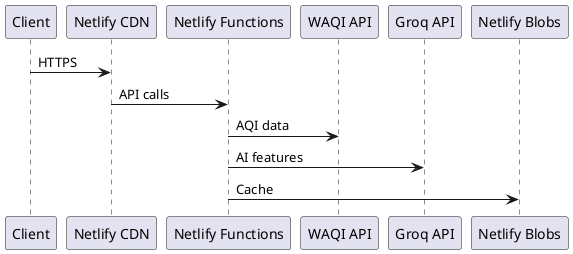

# Development Tooling

This page covers the tools and workflows used to build and maintain JanVayu — with a focus on Claude Code, the primary AI-assisted development tool.

---

## Claude Code (Anthropic)

JanVayu was developed with significant assistance from **Claude Code**, Anthropic's CLI agent for software engineering. Claude Code was used for:

- Writing all 13 Netlify Functions
- Building the entire frontend in `index.html`
- Crafting Llama 3.3 70B prompt engineering (skill files)
- Creating this GitBook documentation
- Managing Git workflow (commits, PRs, changelogs)
- Debugging serverless function issues
- Code review and refactoring

For the complete Claude Code setup, workflow, and configuration used to build JanVayu, see the dedicated [Claude Code section](../claude-code/overview.md).

---

## Editor Configuration

`.editorconfig` standardises formatting across all contributors:

| File type | Indentation |
|-----------|-------------|
| HTML, CSS, JS, JSON, YAML | 2 spaces |
| Python | 4 spaces |
| Makefile | Tabs |

All files: UTF-8, LF line endings, trim trailing whitespace (except Markdown).

---

## Git Workflow

### Commit Message Convention

Enforced by the `commit-msg` hook. Every commit must start with one of:

```
Add:       — New feature or file
Fix:       — Bug fix
Update:    — Enhancement to existing feature
Translate: — New or updated translation
Docs:      — Documentation changes
Refactor:  — Code restructuring (no behaviour change)
Test:      — Test additions or changes
CI:        — CI/CD pipeline changes
Chore:     — Maintenance tasks
Merge:     — Merge commits
```

### Pre-Commit Checks

The `pre-commit` hook automatically:
1. Blocks staging of `.env`, credentials, and secret files
2. Warns about `console.log` debug statements
3. Detects merge conflict markers (`<<<<<<<`)
4. Warns on files larger than 500 KB

### Branch Strategy

- `main` — production (auto-deploys to Netlify)
- `claude/*` — Claude Code development branches (PR to main)
- Feature branches merge via Pull Request

---

## Local Development

```bash
# Install dependencies (server-side only)
npm install

# Run locally with Netlify Functions emulation
netlify dev
```

`netlify dev` emulates the full Netlify environment locally:
- Serves `index.html` on `localhost:8888`
- Emulates all Netlify Functions
- Reads `.env` for environment variables
- Simulates Netlify Blobs

No other setup required. No Docker, no database, no build step.

---

## GitBook Integrations

The documentation site uses these GitBook integrations:

| Integration | What It Does |
|-------------|-------------|
| **GitHub Sync** | Bi-directional sync between `docs/` (and `docs-{lang}/`) and GitBook spaces |
| **Formspree** | Embeds signup/feedback forms directly in published docs |
| **Arcade** | Embeds interactive product demos — record browser walkthroughs, embed with `/arcade` block |
| **PlantUML** | Renders architecture diagrams from `plantuml` code blocks |
| **Plausible** | Privacy-friendly, cookie-free analytics for the docs site |
| **GitHub Files** | Embeds live code snippets from the repo using GitHub permalinks |

### Using Arcade for Interactive Demos

1. Install the [Arcade Chrome extension](https://www.arcade.software/)
2. Record a walkthrough of a JanVayu feature (AQI dashboard, health calculator, etc.)
3. Copy the embed URL from Arcade
4. In GitBook, use the `/arcade` integration block and paste the URL

Free tier includes ~3 published demos with unlimited views.

### Using PlantUML for Diagrams

In any GitBook page, add a `plantuml` code block:

````

````

The diagram renders automatically in the published docs.

---

## CI Workflows

| Workflow | Trigger | Purpose |
|----------|---------|---------|
| **Link Checker** (`.github/workflows/ci.yml`) | Push/PR to `main` | Validates all markdown and HTML links with Lychee |
| **Translation Sync** (`.github/workflows/translations.yml`) | Push to `main` (docs paths) | Checks translation coverage, SUMMARY.md parity, and stale translations |

---

## Dependency Management

- **Dependabot** checks for npm and GitHub Actions updates monthly
- Only 3 npm packages to maintain
- CDN-loaded libraries (Chart.js, Leaflet.js) auto-update to latest stable
